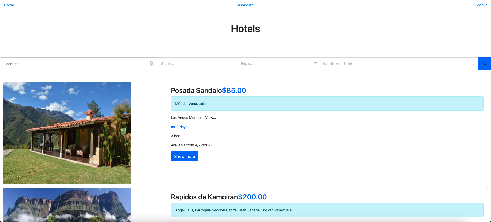
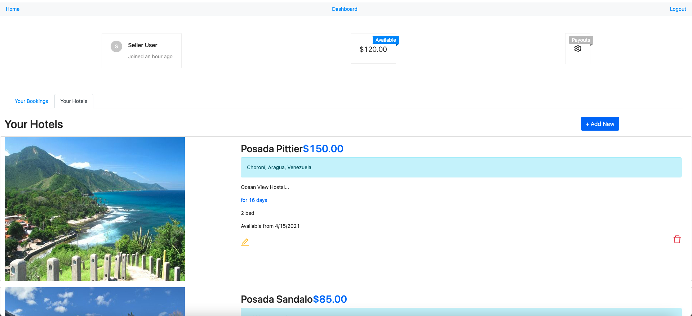
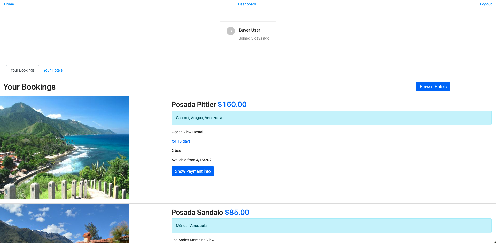

# Project 3
Avila Hotel Booking App

## Table of Contents

* [Description](#Description)
* [Requirements](#Requirements)
* [Installation](#Installation)
* [Usage](#Usage)
* [License](#License)
* [Badges](#Badges)
* [Issues](#Issues)
* [Technologies](#Technologies)
* [Screenshot](#screenshot)
* [Deployment](#deployment)
* [Contributing](#Contributing)
</br>
</br>

## Description
Avila Hotel Booking, is an application to offer lodging options in magnificent views of nature destinations.
<br>
<br>

## Requirements

#### User Story
>Thinking in a near future when the pandemic ends, the demand for travel and specifically looking for good and affordable lodging places.
>>Unfortunately not all lodging places have an online publication, website, or are only known locally.
</br>

>For that reason this web application will serve as a window to the world for those places and make them known to people eager to know and visit new places.

## Installation
To use this application, please install: 
```
npm install
```

<br/>
<br/>

## Usage
In order to use the application, run the following commands:
```
npm start
```

<br/>
<br/>

## License 
[](https://opensource.org/licenses/MIT)
</br>
</br>

## Badges


</br>
</br>

## Issues
[](https://GitHub.com/jorgeebn16/avila-hotel-booking-app/issues/)
[](https://GitHub.com/jorgeebn16/avila-hotel-booking-app/issues?q=is%3Aissue+is%3Aclosed)
</br>
</br>

## Technologies
* [Node](https://nodejs.org/en/)
* [React](https://reactjs.org//)
* [npm](https://www.npmjs.com/)
* [bcrypt](https://www.npmjs.com/package/bcrypt)
* [cors](https://developer.mozilla.org/en-US/docs/Web/HTTP/CORS)
* [jsonwebtoken](https://www.npmjs.com/package/jsonwebtoken)
* [Mongo db](https://www.mongodb.com/)
* [Stripe](https://stripe.com/docs/development)
* [ant-design](https://ant.design/)
* [Algolia Places](https://community.algolia.com/places/)
* [Redux](https://redux.js.org/)

<br/>
<br/>

## Screenshot
<br/>
<br/>
<br/>

</br>
</br>

## Deployment
View [Deployed Portfolio](https://jorgeebn16-avila-booking-app.herokuapp.com/)

## Contributing
[](https://GitHub.com/jorgeebn16/avila-hotel-booking-app/graphs/contributors/)

For anyone who wishes to contribute you can contact me with at jorgeebn16@gmail.com
</br>
</br>

Would you like to reach me?
</br>
Contact Me:

Github: https://github.com/jorgeebn16</br>
Email: jorgeebn16@gmail.com


## Issues
[](https://GitHub.com/jorgeebn16/avila-hotel-booking-app/issues/)
[](https://GitHub.com/jorgeebn16/avila-hotel-booking-app/issues?q=is%3Aissue+is%3Aclosed)

